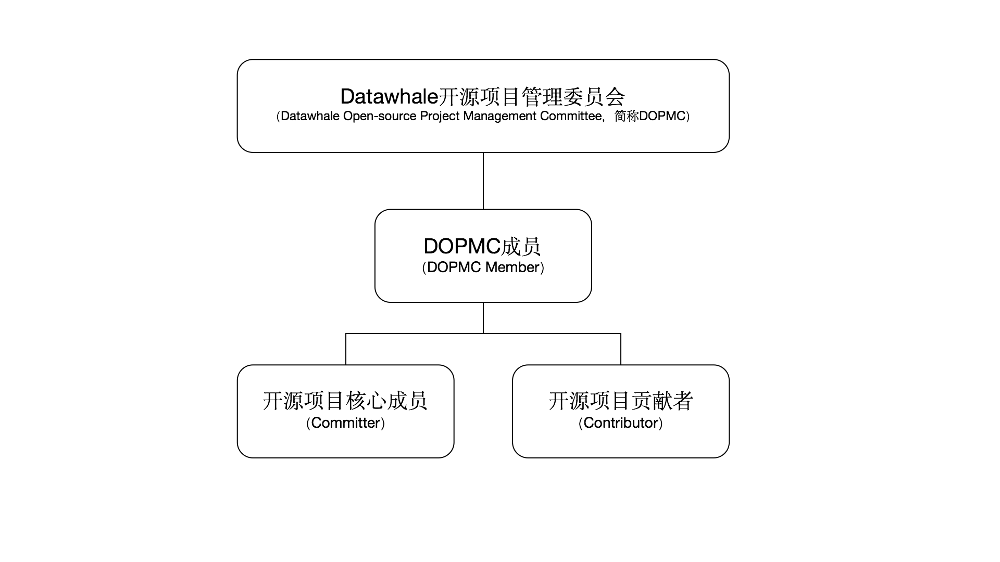

# DOPMC
Datawhale开源项目管理委员会（Datawhale Open-source Project Management Committee，简称DOPMC）

## 我们推出的内容
- [Datawhale人工智能培养方案](https://datawhale.feishu.cn/docs/doccn0AOicI3LJ8RwhY0cuDPSOc)

## 为 Datawhale 做出贡献
*如果你对 Github 的操作不太熟悉，可以查看[Github 极简操作指南](./GITHUB.md)，仅需30秒即可创建属于你的第一个 ISSUE*
### 立项
如果你想发起新的项目或者想做一些有趣的事欢迎提交 ISSUE 来详细描述你要做的事，发起立项需要在 [DOPMC](https://github.com/datawhalechina/DOPMC) 项目的中创建 ISSUE 进行讨论，打开[创建 ISSUE](https://github.com/datawhalechina/DOPMC/issues/new/choose) 页面后点击立项按钮，根据模板填写项目的相关信息
### 反馈
如果你对 Datawhale 目前现状有任何疑惑或者建议欢迎用 ISSUE 的方式进行反馈，反馈需要打开[创建 ISSUE](https://github.com/datawhalechina/DOPMC/issues/new/choose) 页面后点击反馈问题按钮，根据模板填写相关信息。
并不需要担心提出的问题没有价值，我们鼓励所有类型的沟通，发现问题也是对社区进行贡献的一种方式。
### 参与项目
如果你暂时还没有什么想法欢迎浏览我们的 [ISSUE 列表](https://github.com/datawhalechina/DOPMC/issues)看看有哪些是你感兴趣的😊，参与到项目中，或者通过[看板](https://github.com/datawhalechina/DOPMC/projects/1?fullscreen=true)更直观的看到各种事项的进展状态，如果你有任何新的想法，不要担心大胆评论就好。

*ps: 含有 [`help wanted`](https://github.com/datawhalechina/DOPMC/issues?q=is%3Aissue+is%3Aopen+label%3A%22help+wanted%22) 标签的 issue 更容易参与哦💡*

### 参与讨论
我们开放了讨论渠道，如果你有任何想讨论的问题，欢迎通过 [Discussion](https://github.com/datawhalechina/DOPMC/discussions) 与我们交流。

## Datawhale 社区成员体系：
关于 Datawhale 社区成员体系详见：[Roles](./ROLES.md)

## 关注我们

扫描下方二维码关注公众号：Datawhale

