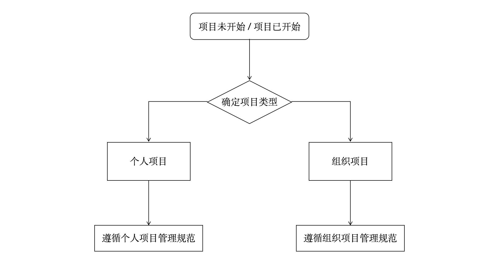

# Datawhale开源项目白皮书（试行）
本白皮书是Datawhale与其下属开源项目团队所约定的协议，由[Datawhale开源项目管理委员会（Datawhale Open-source Project Management Committee，简称DOPMC）](https://github.com/datawhalechina/DOPMC)制定并发行，其旨在规范化管理开源项目，明确Datawhale和开源项目团队各自的责任与义务。
## 1. 开源项目创建流程

## 2. 个人项目管理规范
- 原则上不得在Datawhale社群公开发布招募信息
- 项目内容中不得含有Datawhale相关信息
  
## 3. 组织项目管理规范
### 3.1 立项规范
step1：项目负责人阅读熟知并同意《Datawhale开源项目白皮书》中的所有内容；
step2：项目负责人向DOPMC提交任意形式的项目介绍文档（文档规范参见附录③）；
step3：DOPMC负责人召集全体DOPMC Member进行投票表决是否立项；
step4：立项通过则由DOPMC负责人在Datawhale官方GitHub账号为其创建Team和Repository；
step5：开源项目支持小组（参见附录）辅助项目负责人启动项目；

### 3.2 行为规范
- 项目负责人原则上有且只能有一位；
- 项目状态分为【未完成】和【已完成】两种状态，由DOPMC评估确定；
- 【未完成】状态的项目，其Repository状态为Private，内测期间可临时设为Public，【已完成】状态的项目，其Repository状态为Public；
- 对于【未完成】状态的项目，由开源项目支持小组辅助项目负责人推进项目，直至项目被DOPMC评估为【已完成】状态；
- 对于【未完成】状态的项目，若项目负责人无意继续推进则由开源项目支持小组辅助项目负责人完成项目退出或更换项目负责人；
- 对于【已完成】状态的项目，可以按照项目负责人的需求对外进行正式宣发，【未完成】状态的项目不可对外宣发；
- Issue和Pull request是和用户沟通的最关键渠道，项目负责人和Committer在收到Issue或者Pull request务必及时回复和处理；
- 组织项目并不完全归属于项目负责人，因此项目对外产生合作时，须由开源项目支持小组辅助项目负责人共同对接；
- 项目产生的商业收益大部分归属于项目负责人及其团队；

### 3.3 内容规范
- 文档类的项目统一采用Docsify/Sphinx进行在线展示，同时也需要在项目完成后同步发行PDF版本（推荐使用 LaTeX 进行排版）；
- 项目根目录下的README.md里必须包含以下内容：
  - 项目负责人的联系方式；
  - 项目Committers的名单；
  - Datawhale的外宣信息；
  - 项目所采用的开源协议；
  - 若非完全原创内容，则需要给出必要的版权说明；
- 项目负责人需要为其负责的项目撰写一份《内容规范》，供Contributors和Committers使用；

### 3.4 协作规范
- Contributors和Committers必须严格按照项目负责人撰写的《内容规范》发起Pull Request和Push；
- Contributor发起的Pull requests在被Merge或被Close前，必须由项目负责人或者至少1位Committer进行Review；
- Committer在Push之前必须经过项目负责人Review；

## 附录
### 开源项目支持小组
为各个开源项目团队提供各个方面的资源支持，包括但不限于以下工作：
- 辅助项目负责人进行立项；
- 辅助项目负责人招募成员；
- 为项目负责人提供专业建议；
- 对项目各个阶段进行风险把控；
- 定期跟进开源项目的进度；

### 相关教程
- Sphinx使用教程（by耿远昊）：https://www.bilibili.com/video/BV12B4y1u7PF